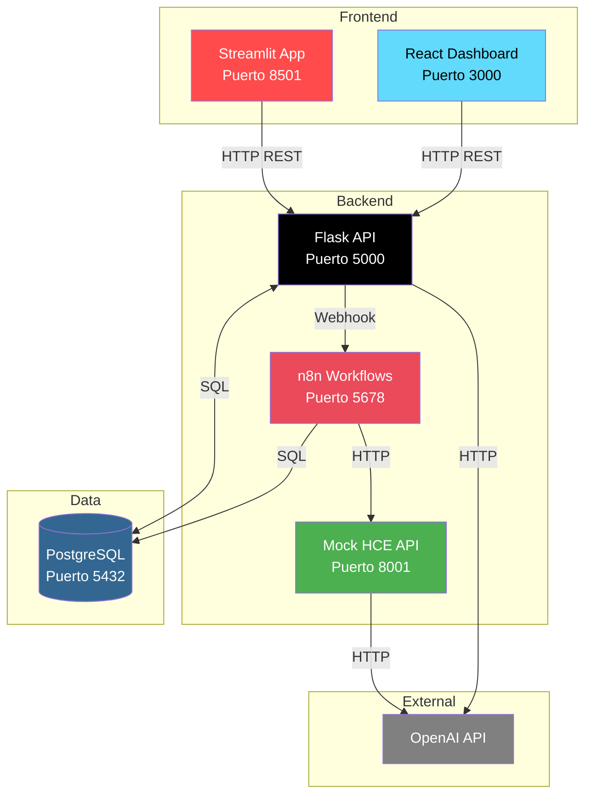
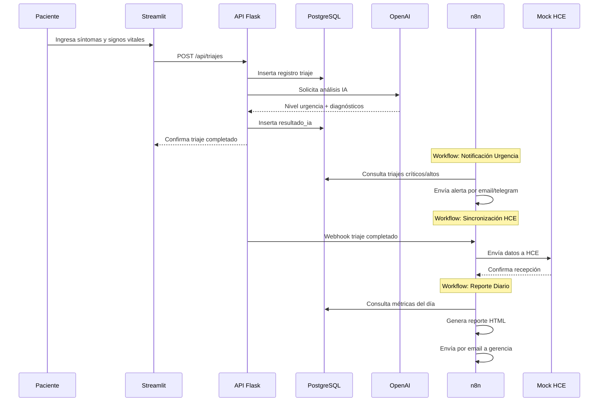
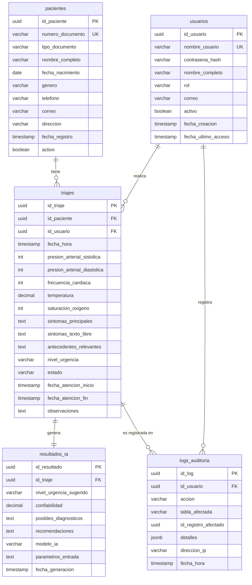

# Sistema de Triaje Clínico Asistido por IA

Sistema completo para triaje clínico con apoyo de inteligencia artificial, integración con HCE simulada y automatización mediante n8n.

## 📋 Tabla de Contenidos

1. [Arquitectura](#arquitectura)
2. [Esquema de Base de Datos](#esquema-de-base-de-datos)
3. [Requisitos](#requisitos)
4. [Despliegue](#despliegue)
5. [Configuración](#configuración)
6. [Workflows n8n](#workflows-n8n)
7. [API Endpoints](#api-endpoints)
8. [Estructura del Proyecto](#estructura-del-proyecto)

---

## 🏗️ Arquitectura



### Flujo de Datos



---

## 🗄️ Esquema de Base de Datos



---

## 📦 Requisitos

| Componente | Requisito | Versión |
|-----------|-----------|---------|
| Docker | Motor de contenedores | 20.10+ |
| Docker Compose | Orquestación | v2.0+ |
| Python | Backend API, Streamlit | 3.10+ |
| Node.js | React Dashboard | 18.0+ |
| PostgreSQL | Base de datos | 15+ |
| n8n | Automatización | Latest |

---

## 🚀 Despliegue

### 1. Clonar o crear la estructura del proyecto

```bash
git clone https://github.com/tu-usuario/triage-ia.git
cd triage-ia
```

O crea manualmente la estructura:

```
triage-ia/
├── backend/
│   ├── n8n-workflows/
│   ├── sql/
│   └── mock-hce/
├── frontend/
│   ├── streamlit/
│   └── react/
├── api/
├── docker-compose.yml
├── .env.example
├── requirements.txt
└── README.md
```

### 2. Configurar variables de entorno

```bash
cp .env.example .env
```

Edita `.env` con tus configuraciónes:

```env
# Database
POSTGRES_HOST=localhost
POSTGRES_PORT=5432
POSTGRES_DB=triage_ia
POSTGRES_USER=postgres
POSTGRES_PASSWORD=postgres123

# OpenAI (opcional para IA real)
OPENAI_API_KEY=sk-tu-api-key-aqui
OPENAI_MODEL=gpt-4
```

### 3. Iniciar servicios con Docker Compose

```bash
# Iniciar todos los servicios
docker-compose up -d

# Ver estado de servicios
docker-compose ps

# Ver logs
docker-compose logs -f
```

### 4. Verificar servicios

| Servicio | URL | Credenciales |
|----------|-----|--------------|
| API Flask | http://localhost:5000 | - |
| Streamlit | http://localhost:8501 | admin/admin123 |
| n8n | http://localhost:5678 | admin/admin123 |
| Mock HCE | http://localhost:8001 | - |
| React Dashboard | http://localhost:3000 | - |

### 5. Inicializar base de datos

El schema se ejecuta automáticamente al primer inicio via `docker-entrypoint-initdb.d`. Para ejecutarlo manualmente:

```bash
docker exec -it triage_postgres psql -U postgres -d triage_ia -f /docker-entrypoint-initdb.d/schema.sql
```

### 6. Importar workflows de n8n

1. Abre http://localhost:5678
2. Inicia sesión con `admin` / `admin123`
3. Ve a **Settings** → **Credentials** → **+ New Credential**
4. Configura conexión a PostgreSQL:
   - Host: `postgres`
   - Port: `5432`
   - Database: `triage_ia`
   - User: `postgres`
   - Password: `postgres123`
5. Ve a **Workflows** → **Import from File**
6. Importa cada workflow de `backend/n8n-workflows/`:
   - `workflow_notificacion_urgencia.json`
   - `workflow_sincronizacion_hce.json`
   - `workflow_reporte_diario.json`

### 7. Ejecutar Streamlit (desarrollo)

```bash
pip install -r requirements.txt
pip install streamlit plotly pandas

# Crear archivo .env con OPENAI_API_KEY si deseas IA real

streamlit run frontend/streamlit/app.py --dev
```

### 8. Ejecutar React Dashboard (desarrollo)

```bash
cd frontend/react
npm install
npm run dev
```

---

## ⚙️ Configuración

### Variables de entorno

| Variable | Descripción | Valor por defecto |
|----------|-------------|-------------------|
| `POSTGRES_HOST` | Host de PostgreSQL | localhost |
| `POSTGRES_PORT` | Puerto de PostgreSQL | 5432 |
| `POSTGRES_DB` | Nombre de base de datos | triage_ia |
| `POSTGRES_USER` | Usuario de PostgreSQL | postgres |
| `POSTGRES_PASSWORD` | Contraseña de PostgreSQL | postgres123 |
| `OPENAI_API_KEY` | Clave de API OpenAI | (vacío) |
| `OPENAI_MODEL` | Modelo de OpenAI a usar | gpt-4 |
| `HCE_API_URL` | URL de Mock HCE | http://localhost:8001 |

### Credenciales de acceso

| Servicio | Usuario | Contraseña |
|----------|---------|------------|
| n8n | admin | admin123 |
| Streamlit | admin | admin123 |
| Operador | operador | admin123 |

---

## 🔄 Workflows n8n

### Workflow 1: Notificación de Urgencia

**Archivo:** `backend/n8n-workflows/workflow_notificacion_urgencia.json`

**Función:** Detecta triajes de nivel alto o crítico y envía notificaciones.

**Trigger:** Programado (diario a las 8:00 AM)

**Flujo:**
```
Scheduled Trigger → Query PostgreSQL → IF (hay triajes?) → Preparar Mensaje → Log → Enviar Email + Telegram
```

### Workflow 2: Sincronización con HCE

**Archivo:** `backend/n8n-workflows/workflow_sincronizacion_hce.json`

**Función:** Envía datos del triaje completado a la HCE simulada.

**Trigger:** Webhook POST `/webhook/triaje-completado`

**Flujo:**
```
Webhook → Parse Body → HTTP Request a HCE → Log → Response
```

**Uso:**
```bash
curl -X POST http://localhost:5678/webhook/triaje-completado \
  -H "Content-Type: application/json" \
  -d '{"id_triaje": "uuid", "nivel_urgencia": "alto", ...}'
```

### Workflow 3: Reporte Diario

**Archivo:** `backend/n8n-workflows/workflow_reporte_diario.json`

**Función:** Genera y envía reporte diario de triajes.

**Trigger:** Programado (diario a las 8:00 PM)

**Flujo:**
```
Scheduled Trigger → Query Métricas → Query Por Profesional → Query Por Hora → Generar HTML → Enviar Email
```

---

## 🔌 API Endpoints

### Autenticación

```
POST /api/auth/login
Body: {"nombre_usuario": "admin", "contrasena": "admin123"}
Response: {"id_usuario": "uuid", "nombre_usuario": "admin", "rol": "administrador"}
```

### Pacientes

```
GET /api/pacientes?busqueda=&page=1&per_page=20
Response: {"pacientes": [...], "total": 100, "page": 1}

GET /api/pacientes/{id_paciente}
Response: {...paciente}

POST /api/pacientes
Body: {"numero_documento": "12345678", "nombre_completo": "...", ...}
Response: {...paciente}
```

### Triajes

```
GET /api/triajes?fecha_desde=&fecha_hasta=&nivel_urgencia=&page=1
Response: {"triajes": [...], "total": 100}

GET /api/triajes/{id_triaje}
Response: {...triaje, "resultado_ia": {...}}

POST /api/triajes
Body: {"id_paciente": "uuid", "presion_arterial_sistolica": 120, ...}
Response: {...triaje}

PUT /api/triajes/{id_triaje}/completar
Body: {"nivel_urgencia": "moderado", "resultado_ia": {...}}
Response: {...triaje}
```

### Dashboards

```
GET /api/dashboard/operacional?fecha=2026-04-29
Response: {
  "metricas": {"total_triajes": 45, "criticos": 3, "altos": 8, ...},
  "triajes_por_hora": [...],
  "distribucion_urgencia": [...]
}

GET /api/dashboard/gestion?mes=2026-04
Response: {
  "metricas": {"total_triajes": 450, ...},
  "triajes_por_dia": [...],
  "triajes_por_profesional": [...],
  "distribucion_urgencia": [...]
}
```

### HCE

```
GET /api/hce/{numero_documento}/antecedentes
Response: {"antecedentes": [...], "historial_sintomas": [...]}
```

---

## 📁 Estructura del Proyecto

```
triage-ia/
├── backend/
│   ├── n8n-workflows/
│   │   ├── workflow_notificacion_urgencia.json
│   │   ├── workflow_sincronizacion_hce.json
│   │   └── workflow_reporte_diario.json
│   ├── sql/
│   │   └── schema.sql
│   └── mock-hce/
│       ├── app.py
│       ├── requirements.txt
│       └── Dockerfile
├── frontend/
│   ├── streamlit/
│   │   ├── app.py
│   │   ├── utils.py
│   │   └── pages/
│   │       ├── nuevo_triaje.py
│   │       ├── pacientes.py
│   │       └── dashboards.py
│   └── react/
│       ├── package.json
│       ├── vite.config.js
│       ├── tailwind.config.js
│       ├── index.html
│       └── src/
│           ├── App.jsx
│           ├── index.js
│           ├── index.css
│           ├── components/
│           │   ├── MetricCard.jsx
│           │   ├── Charts.jsx
│           │   ├── DashboardOperativo.jsx
│           │   └── DashboardGestion.jsx
│           └── services/
│               └── api.js
├── api/
│   ├── app.py
│   ├── requirements.txt
│   └── Dockerfile
├── docker-compose.yml
├── .env.example
├── requirements.txt
└── README.md
```

---

## 🔒 Seguridad

### Medidas implementadas

1. **Autenticación:** Sistema de login con contraseñas hasheadas (bcrypt)
2. **Logs de auditoría:** Todas las acciones importantes quedan registradas
3. **Variables de entorno:** Credenciales fuera del código fuente
4. **CORS:** Configurado para permitir solo orígenes permitidos

### Recomendaciones para producción

1. Usar HTTPS obligatoriamente
2. Configurar PostgreSQL con SSL
3. Implementar rate limiting en API
4. Usar secrets management (AWS Secrets Manager, HashiCorp Vault)
5. Configurar backups automáticos de PostgreSQL
6. Implementar logs centralizados
7. Usar firewall para restringir acceso a puertos

---

## 📊 Dashboards

### Dashboard Operacional

- Total triajes del día
- Casos críticos y altos
- Tiempo promedio de atención
- Distribución por nivel de urgencia (gráfico de torta)
- Triajes por hora (gráfico de barras)

### Dashboard de Gestión

- Métricas mensuales agregadas
- Tendencias de casos por día (gráfico de líneas)
- Triajes por profesional (gráfico de barras horizontal)
- Análisis de distribución por urgencia
- Porcentajes de casos críticos y altos

---

## 🧪 Testing

### Probar API

```bash
# Health check
curl http://localhost:5000/health

# Login
curl -X POST http://localhost:5000/api/auth/login \
  -H "Content-Type: application/json" \
  -d '{"nombre_usuario": "admin", "contrasena": "admin123"}'

# Listar pacientes
curl http://localhost:5000/api/pacientes

# Crear paciente
curl -X POST http://localhost:5000/api/pacientes \
  -H "Content-Type: application/json" \
  -d '{"numero_documento": "12345678", "nombre_completo": "Test User", "fecha_nacimiento": "1990-01-01", "genero": "M"}'
```

---

## 📝 Licencia

MIT License - Ver archivo LICENSE para más detalles.

---

## 🤝 Contribuir

1. Fork el repositorio
2. Crea una rama para tu feature (`git checkout -b feature/nueva-funcionalidad`)
3. Commit tus cambios (`git commit -am 'Agrega nueva funcionalidad'`)
4. Push a la rama (`git push origin feature/nueva-funcionalidad`)
5. Crea un Pull Request

---

**Desarrollado con ❤️ para mejorar la atención médica mediante IA**
